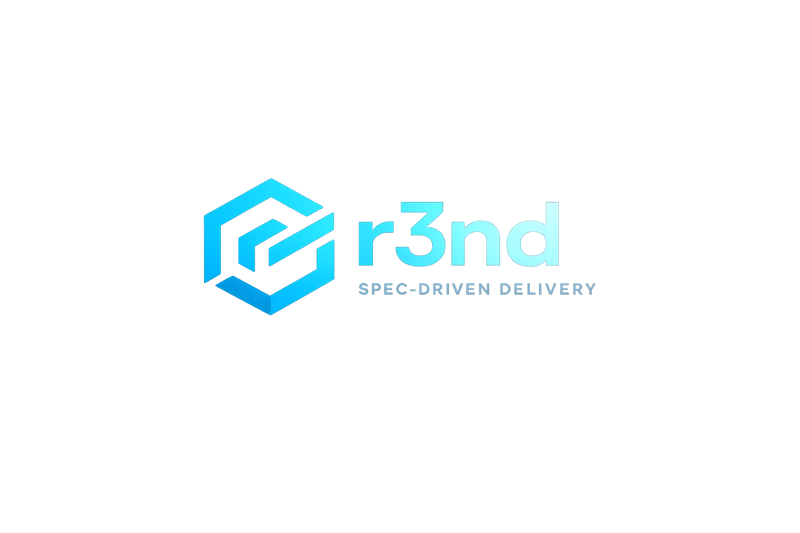

# r3nd - *Spec-Driven* SDLC Framework



[](https://github.com/leandronoijo/r3nd/releases/tag/0.3)
[](LICENSE.md)

r3nd is a **spec-driven SDLC framework** for building robust systems fast. It gives teams a **shared operating model** built around repo-native skills, explicit artifacts, reusable overlays, and persistent context, and it works across **Cursor, Codex, Copilot, and Claude Code**.

r3nd is designed to help teams:

- align on the same **skills, practices, and decision-making structure**
- move quickly while keeping **architecture and implementation reviewable**
- save knowledge in the repository instead of in *disappearing chat history*
- push small decisions down into **repeatable workflows** so humans can focus on important ones
- work on multiple things at the same time without losing context

This repository is a **seed project**. Fork it, adapt the markdown files to your own standards, and make it your team’s operating system for AI-assisted software delivery.

---

## ✨ What r3nd Is

r3nd combines five ideas into one system:

1. A repository structure for **persistent engineering knowledge**
2. A set of skills and agent roles for **repeatable SDLC workflows**
3. Templates that make outputs **predictable and reviewable**
4. Overlays that inject **stack-specific rules** into a repo
5. Vendor-agnostic execution so the same system works across different AI tools

The result is a framework for moving from request to implementation in a way that stays legible to the whole team.

---

## 📚 Docs

Start with:

- [Getting Started](docs/getting-started.md)
- [Concepts](docs/concepts.md)
- [Workflows](docs/workflows.md)

These pages cover onboarding, the repo-native model behind r3nd, and the workflow options in more detail than this landing page.

---

## 🚦 Core Workflows

r3nd supports four practical ways of working.

**Legend**: **🤖 LLM** = the agent does the work. **👤 Human** = a person reviews, approves, or redirects the flow.

### 1. Full Control Workflow

Use this when the work is **important, ambiguous, or architectural**.

**Human verification** happens between each stage.

**Human role**: review each artifact, approve direction changes, and decide whether the next stage should start.

**LLM agent role**: produce the current stage artifact, implement against approved artifacts, and execute verification work.

The main skills are:

- `create-product-spec`
- `create-tech-spec`
- `create-build-plan`
- `implement-build-plan` or `implement-feature`
- `create-test-cases`
- `run-e2e-tests`
- `run-manual-qa-tests`
- `create-retro-report`

*Typical flow:*

1. **Product spec** via `create-product-spec`
   - **🤖 LLM**: defines the feature, goals, scope, constraints, and expected outcomes.
   - **👤 Human**: reviews whether the request is framed correctly.
2. **Tech spec** via `create-tech-spec`
   - **🤖 LLM**: turns the product intent into a technical design with boundaries, interfaces, and decisions.
   - **👤 Human**: approves the design direction.
3. **Build plan** via `create-build-plan`
   - **🤖 LLM**: breaks the design into concrete implementation tasks that can be executed and reviewed.
   - **👤 Human**: checks whether the plan is acceptable before coding starts.
4. **Implementation** via `implement-build-plan` or `implement-feature`
   - **🤖 LLM**: delivers the code against the approved plan instead of improvising from chat context.
   - **👤 Human**: stays at the approval boundary rather than micromanaging every edit.
5. **Test cases and QA** via `create-test-cases`, `run-e2e-tests`, and `run-manual-qa-tests`
   - **🤖 LLM**: verifies the behavior, runs checks, and performs the final QA itself, including **manual QA with real tools**.
   - **👤 Human**: reviews the evidence rather than executing the QA personally.
6. **Retro** via `create-retro-report`
   - **🤖 LLM**: captures what worked, what failed, and what should be improved in the system itself.
   - **👤 Human**: uses that feedback to refine the workflow.

This is the **highest-control mode**. It is the best fit when you want explicit handoffs, explicit review points, and maximum traceability.

### 2. Semi-Control Workflow

Use this when the product intent is already clear and you want to **move faster without skipping structure**.

**Human role**: approve the technical direction and review the delivered implementation and QA evidence.

**LLM agent role**: create the tech spec, ensure the required task plans exist, implement the feature, and run QA.

The main skills are:

- `create-tech-spec`
- `implement-feature`

*Typical flow:*

1. **Tech spec**
   - **🤖 LLM**: defines the architecture, interfaces, constraints, and task boundaries for the feature.
   - **👤 Human**: confirms that the approach is sound enough to proceed.
2. **Build-plan assurance** inside `implement-feature`
   - **🤖 LLM**: generates missing task plans if they do not already exist, so implementation still happens against explicit artifacts.
3. **Dependency-aware implementation**
   - **🤖 LLM**: executes the work in task order so dependent pieces do not drift apart.
4. **Task-level QA gates**
   - **🤖 LLM**: verifies each task before dependent work continues.
5. **Final QA**
   - **🤖 LLM**: runs the written checks and performs **manual QA with real tools** before the feature is considered done.
   - **👤 Human**: reviews the result and decides whether to accept it.

This keeps architecture and implementation disciplined while removing some of the ceremony of the full chain.

### 3. Small Feature Workflow

Use this for **very small, clearly bounded work**.

**Human role**: approve the single plan and review the result.

**LLM agent role**: investigate the change, decide if it qualifies for the quick path, implement it, and verify it.

The main skill is:

- `quick-feature`

*Typical flow:*

1. **Investigation**
   - **🤖 LLM**: inspects the existing code and confirms the request matches the current system.
2. **Eligibility gate**
   - **🤖 LLM**: stops early if the change is too large, too structural, or too ambiguous for a quick path.
3. **Single build plan**
   - **🤖 LLM**: writes exactly one small plan for the work instead of opening a larger delivery chain.
4. **Explicit approval**
   - **👤 Human**: approves or rejects the plan before any implementation starts.
5. **Implementation**
   - **🤖 LLM**: applies the change within the strict scope of the quick-feature contract.
6. **Verification**
   - **🤖 LLM**: runs focused checks and performs **manual QA with real tools** so the feature stays small but still gets validated.

This is the **fast path** for work that should stay tiny, local, and tightly controlled.

### 4. Bugfix Workflow

Use this for **focused defect resolution**.

**Human role**: confirm the plan before the fix is applied and review the verification evidence.

**LLM agent role**: turn the bug report into a plan, implement the fix, and verify the result.

The main workflow is:

- `bugfix`

*Typical flow:*

1. **Bug description**
   - **👤 Human** or **🤖 LLM**: captures the problem clearly enough to plan the fix against a concrete failure.
2. **Build plan**
   - **🤖 LLM**: writes a focused plan for the bug so the fix is intentional instead of reactive.
3. **Approval**
   - **👤 Human**: reviews the plan before implementation starts.
4. **Fix implementation**
   - **🤖 LLM**: applies the change against the approved plan.
5. **Verification**
   - **🤖 LLM**: confirms the defect is resolved, checks for obvious regressions, and when needed performs **manual QA with real tools** rather than leaving that step implicit.

This keeps bug work disciplined instead of letting production pressure collapse directly into ad hoc edits.

---

## 💡 Why Teams Use It

### Shared team alignment

r3nd gives the company or team **one common delivery language**:

- the same skills
- the same templates
- the same artifact chain
- the same expectations around review and verification

### Persistent repo knowledge

Knowledge is saved in the repository, not trapped in **one assistant session**.

That includes:

- specs
- plans
- instructions
- generated context files
- QA artifacts
- retros

### Better focus

r3nd helps you **see further into the design process**, handles smaller routine decisions through repeatable structure, and leaves the important tradeoffs for humans.

### Parallel work without chaos

Because context is written down and work is split into artifacts, multiple efforts can move in parallel without relying on one person to remember every decision.

### Vendor independence

The framework is **agnostic**. You can run the same operating model on:

- Cursor
- Codex
- GitHub Copilot
- Claude Code

*The vendor changes. The workflow does not.*

---

## 🧠 Knowledge Lives In The Repo

This is **one of the core ideas** behind r3nd.

By default, the durable SDLC knowledge lives under `r3nd/`:

- `product_specs/`
- `tech_specs/`
- `build_plans/`
- `test_cases/`
- `e2e-results/`
- `retros/`
- `agent_summaries/`
- `templates/`
- `skills/`

Stack- and repo-specific operating rules now live in **overlays**, which can add:

- skills
- agents
- instructions
- templates
- build plans

The repo can also generate **scoped context files** that work alongside those overlays:

- `AGENTS.md`
- `CLAUDE.md`

These can be created at:

- repo level
- app level
- service or module level

They are generated by `r3nd analyse` and by the analysis skills:

- `analyze-repo-context`
- `analyze-app-context`
- `analyze-module-context`

This lets each part of a codebase carry its own **local operating context** instead of forcing everything into one global prompt.

---

## 🚀 Get Started

### 1. Install r3nd

```bash
# Install globally from GitHub
npm install -g git+https://github.com/leandronoijo/r3nd.git#0.3
```

### 2. Fork the seed

```bash
git clone https://github.com/leandronoijo/r3nd.git
```

### 3. Initialize or scaffold

```bash
# Minimal setup
r3nd init

# Full setup for new projects
# Current overlay options include:
# angular, fast-api, nestjs, ruby-on-rails, vue
r3nd scaffold
```

### 4. Adapt the markdown

Update the parts that define how your team **actually works**:

- `r3nd/templates/*`
- `r3nd/skills/*`
- `r3nd/agents/*`
- `overlays/*`
- `AGENTS.md` / `CLAUDE.md`

In this seed repository, the source content still lives under `rnd/`. The CLI maps that seed content into your configured spec directory, which is canonically `r3nd/` for generated projects.

### 5. Generate local context

Preferred option: use the generated analysis skills in **your favorite LLM coding tool** to create scoped `AGENTS.md` / `CLAUDE.md` files.

Use:

- `analyze-repo-context`
  - **What it does**: generates **repo-level** context for the whole codebase.
  - **When to use it**: when you want the top-level operating map of the repository, its apps, boundaries, and shared rules.
  - **Input**: the **repo root path**, usually `.`.
- `analyze-app-context`
  - **What it does**: generates **app-level** context for one application inside a larger repo.
  - **When to use it**: when a repo contains multiple apps or services and one app needs its own local guidance.
  - **Input**: the **app root path**, for example `apps/backend`.
- `analyze-module-context`
  - **What it does**: generates **module-level** context for a focused area inside an app or service.
  - **When to use it**: when a specific module, bounded context, or service needs tighter local instructions than the app-level file.
  - **Input**: the **module path**, for example `apps/backend/src/modules/auth`.

Secondary option: use the r3nd CLI directly.

```bash
r3nd analyse
```

Or target a specific scope:

```bash
r3nd agents analyze-repo-context --input . --agent codex
r3nd agents analyze-app-context --input apps/backend --agent codex
r3nd agents analyze-module-context --input apps/backend/src/modules/auth --agent claude
```

### 6. Choose the right workflow

- Bigger, riskier, or more architectural work: full control workflow
- Clear feature with less ceremony: semi-control workflow
- Small bounded change: `quick-feature`
- Focused defect: `bugfix`

---

## 🌿 Worktrees

r3nd includes developer worktree support so **parallel efforts stay isolated** and easy to manage.

Examples:

```bash
r3nd worktree
r3nd worktree --list
r3nd worktree auth-investigation
r3nd worktree --branch auth-investigation
r3nd worktree auth-investigation --no-command
r3nd worktree clean
```

The worktree flow can:

- create repo-scoped git worktrees
- open an existing worktree
- clean up r3nd-managed clean worktrees
- list all worktrees in `git worktree list` format
- copy vendor directories like `.claude`, `.codex`, `.github`, and `.cursor` into the new worktree when present
- accept branch names via `r3nd worktree [branch]` or `--branch`
- skip the open command with `--no-command` and print the created/selected worktree path instead

What gets copied into a new worktree and what command gets run afterward are both configurable in `r3nd.yaml`.

CLI defaults from `r3nd.yaml.example`:

```yaml
worktree-copy-files:
  - "*.env"
  - "**/*.env"

worktree-open-command:
  - code
  - "{worktreeDir}"
```

Example setup for working in **tmux** with different panes, or in **VS Code** when not inside tmux:

```yaml
worktree-copy-files:
  - "*.env"
  - "**/*.env"
  - ".gitignore"

worktree-open-command:
  - sh
  - -lc
  - |
    worktree_dir=$1
    branch_name=$(git -C "$worktree_dir" rev-parse --abbrev-ref HEAD 2>/dev/null || basename "$worktree_dir")

    if [ -n "${TMUX:-}" ]; then
      pane_id=$(tmux split-window -P -F "#{pane_id}" -c "$worktree_dir")
      tmux select-pane -t "$pane_id" -T "$branch_name"
    else
      code "$worktree_dir"
    fi
  - sh
  - "{worktreeDir}"
```

This is useful when you are running **multiple investigations or features in parallel**.

---

## 🧭 Philosophy

### Skills

Skills are the **executable operating procedures** of r3nd.

A skill should encode how work is done, not just what tool to call. It should define:

- the purpose of the workflow
- the required inputs and outputs
- the phase order
- the non-negotiable rules
- the approval gates
- the file paths and artifacts that make the work durable

In other words: **skills are how a team standardizes practice**.

### Agents

Agents are **role boundaries**.

They exist to keep responsibilities narrow and deterministic. A Product Manager should not behave like a Developer. A Team Lead should not silently absorb QA. The goal is not roleplay. The goal is reducing ambiguity in how work gets executed.

Agents are the behavioral primitives that skills compose.

### Vendors

Vendors are **execution backends**, not the source of truth.

Codex, Cursor, Copilot, and Claude Code are different ways to run the same repo-defined operating model. The knowledge, rules, skills, and templates should remain in the repository so the framework survives tool changes.

### Templates

Templates are **contracts for artifacts**.

They make outputs predictable, reviewable, and machine-usable. A good template reduces ambiguity for both humans and AI by turning "write something useful" into "produce this artifact in this shape for this next consumer."

### Overlays

Overlays are how you **adapt r3nd to a real stack**.

They add or refine:

- skills
- agents
- instructions
- templates
- build plans

An overlay should inject stack or domain knowledge without changing the core philosophy of the framework.

---

## 🌱 Seed Project Model

This repository is meant to be **forked and adapted**.

You should treat the markdown files as the **real product surface**:

- `r3nd/templates/*`
- `r3nd/skills/*`
- `r3nd/agents/*`
- `overlays/*`
- `AGENTS.md` / `CLAUDE.md`

In this seed repository itself, those source files are stored under `rnd/`, but generated projects should treat `r3nd/` as the canonical spec directory unless configured otherwise.

The normal adoption path is:

1. Fork the repository
2. Adapt the markdown files to match your engineering standards
3. Add or refine overlays for your stack
4. Generate repo/app/module context files
5. Start using the workflow that matches the size of the task

If your team does not customize the markdown, you are **not really adopting r3nd**. You are only trying the default seed.

---

## 🔌 Vendor-Agnostic Execution

r3nd is **intentionally agnostic**.

It can generate or support outputs for:

- `.cursor/skills/<task>/SKILL.md`
- `.claude/skills/<task>/SKILL.md`
- `.codex/skills/<task>/SKILL.md`
- `.github/chatmodes/`

This means the same workflow can be carried through different tools while keeping the **repository as the real authority**.

---

## 🛠️ Tooling

The CLI is an **operator tool** around the framework.

It helps with:

- initializing a repo with the seed structure
- scaffolding and applying overlays
- updating seed components
- generating scoped context files
- running skills and agent-driven workflows
- managing worktrees

### Core Commands

| Command | Purpose |
|---------|---------|
| `init` | Initialize the current repository with the minimal r3nd seed files |
| `scaffold` | Scaffold a new project with ordered overlays from the seed repo |
| `update` | Update r3nd components from the seed repository |
| `analyse` | Generate `AGENTS.md` / `CLAUDE.md` context files from an existing codebase |
| `agents` | Run task skills for specs, plans, implementation, QA, and analysis |
| `tools` | Show which AI backends are available locally |
| `config` | Manage `r3nd.yaml` |
| `worktree` | Create, open, and clean repo-scoped worktrees |

### Common Agent Tasks

| Task | Purpose |
|------|---------|
| `create-product-spec` | Generate a product spec from a feature description |
| `create-tech-spec` | Generate a tech spec from a product spec |
| `create-build-plan` | Generate a build plan from a tech spec or problem statement |
| `implement-build-plan` | Implement a single build plan to completion |
| `implement-feature` | Coordinate feature delivery across build plans and QA gates |
| `create-test-cases` | Generate E2E or QA test cases from a build plan |
| `run-e2e-tests` | Execute E2E tests and produce result artifacts |
| `manual-qa-report-to-html` | Convert a manual QA markdown result into an HTML evidence report |
| `create-retro-report` | Produce a retro from the delivery flow |
| `analyze-repo-context` | Generate repo-level context files |
| `analyze-app-context` | Generate app-level context files |
| `analyze-module-context` | Generate module-level context files |

### Additional Canonical Workflows

These are part of the shipped framework. In generated projects they live in `r3nd/skills/`, while this seed repository stores the source content under `rnd/skills/`.

| Workflow | Purpose |
|----------|---------|
| `quick-feature` | Run the small-feature path for tightly scoped work |
| `bugfix` | Run the bugfix path with plan approval before implementation |

### Example Commands

```bash
# Initialize the seed structure
r3nd init

# Scaffold with overlays
r3nd scaffold

# Generate repo-level context
r3nd analyse

# Create a product spec
r3nd agents create-product-spec --input "User authentication system" --agent github

# Create a tech spec
r3nd agents create-tech-spec --file r3nd/product_specs/auth.md --agent codex

# Implement a feature from a tech spec
r3nd agents implement-feature --file r3nd/tech_specs/auth.md --agent codex
```

---

## 🗂️ Repo Structure

```text
.github/
  chatmodes/                 # VS Code / Copilot chat modes
  workflows/                 # Optional GitHub workflow automation
  copilot-instructions.md    # Copilot-specific global instructions

.cursor/
.claude/
.codex/                      # Vendor-specific generated outputs

cli/                         # Operator tooling around the framework

rnd/                        # Seed-repo source content; copied into your configured spec dir
  agents/                    # Shared agent briefs
  templates/                 # Canonical artifact templates
  skills/                    # Canonical task skills
  product_specs/
  tech_specs/
  build_plans/
  test_cases/
  retros/
  agent_summaries/

r3nd/                       # Canonical generated spec directory in consumer projects

overlays/                    # Stack- or domain-specific additions, including instructions

AGENTS.md / CLAUDE.md        # Generated at repo/app/module scope and used with overlays
```

---

## 📐 Principles

### Human review stays in the loop

r3nd is designed so important work can be reviewed as artifacts, not just observed as output.

### Repository memory beats chat memory

The source of truth should live in files that the team owns.

### Structure should make speed safer

The point is not process for its own sake. The point is moving faster without becoming opaque.

### Agnostic systems outlast vendor cycles

The framework should survive model, IDE, and tooling changes.
