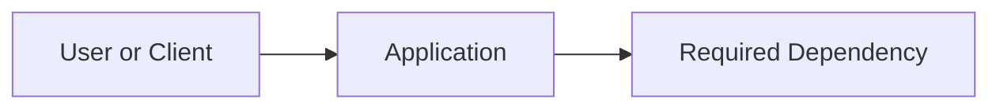

# Technical Specification — <Feature Name>

- **Feature ID:** `<feature-id>`
- **Source:** Direct requirements, issue, or supplied supporting document
- **Author:** Engineer
- **Date:** `<yyyy-mm-dd>`
- **Status:** Draft | Approved

## 1. Outcome And Scope

### Required behavior

- **FR1:** <observable requirement>
- **FR2:** <observable requirement>

### Essential constraints

- <constraint that changes the design or production baseline>

### Out of scope

- <explicitly deferred behavior or hardening>

### Assumptions

- <reversible assumption made to keep moving>

## 2. Existing Context

- `<path>` — <what is reused or changed>
- `<path>` — <relevant existing delivery, runtime, or security pattern>

## 3. Reuse And Dependency Decisions

List each substantial commodity capability the slice needs. Prefer an existing or mature package over a custom mechanism. If custom infrastructure is unavoidable, name the packages considered and the concrete production constraint that ruled them out.

| Concern | Existing Capability Inspected | Selected Package Or Tool | Custom Code Boundary And Rationale |
|---------|-------------------------------|--------------------------|------------------------------------|
| `<persistence, validation, auth, HTTP, logging, etc.>` | `<manifest, lockfile, framework feature, or existing module>` | `<existing or mature package; version/constraint when relevant>` | `<product-specific glue only, or justified exception>` |
| Relational data and migrations | `<existing data-access pattern or None>` | `<ORM and its supported migration tool, or Not applicable>` | `<focused raw SQL exception and reason, or None>` |

## 4. Components And Contracts

| Boundary | Contract | Owner |
|----------|----------|-------|
| `<caller -> callee>` | `<request/input -> response/output>` | `<component>` |

## 5. Minimum Production Baseline

Use `Not applicable — <reason>` when a concern does not apply. Do not invent a subsystem merely to fill the table.

| Concern | Decision And Minimum Implementation |
|---------|-------------------------------------|
| CI | <existing/new workflow and required lint, type, test, build, and image checks> |
| Runtime and config | <production Dockerfile, required services, health/readiness, environment variables, secret source> |
| Security | <trust boundaries, validation, authn/authz, sensitive data and error handling> |
| Identity and tenancy | <public/authenticated/tenant-scoped; ownership and isolation rule> |
| Compatibility and data | <affected consumers/data, additive or breaking change, migration and rollback> |
| Operability | <structured logs, correlation, health signals, and only actionable metrics> |

## 6. Non-Obvious Implementation Details

- **Algorithm or state transition:** <only what implementers must agree on>
- **Data shape and lifecycle:** <essential fields, ownership, retention, or migration>
- **Failure behavior:** <safe observable response and operational signal>
- **Deployment or rollback:** <smallest useful release/backout detail>

## 7. Verification

- **Unit:** <new behavior and important failure/authorization case>
- **Boundary/contract:** <one production-risk boundary to test, or Not applicable with reason>
- **CI:** <commands/checks that must pass>
- **Runtime smoke:** <container start plus health/readiness check, or Not applicable>
- **Optional QA candidates:** <primary flow and any critical security/tenant/compatibility edge>
- **QA choice:** Ask after implementation; do not decide in the spec.

## 8. Tasks

### T1 — <vertical slice or bounded deliverable>

- **Outcome:** <working, deployable result>
- **Scope:** <files/components or behavior>
- **Depends on:** None | T<n>
- **Consumes/Exposes:** <contract needed by another task, or None>
- **Production baseline:** <CI/runtime/security/compatibility/operability work owned here>
- **Acceptance:** <observable result and focused checks>

<!-- Add another task only when separate ownership or dependency ordering is useful. -->

## 9. Blocking Questions

- None | <question whose answer can change behavior, data, a public contract, security, tenancy, or technology>
