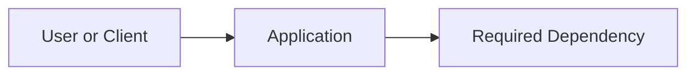

# Technical Specification — <Feature Name>

- **Feature ID:** `<feature-id>`
- **Source:** Direct requirements, issue, or supplied supporting document
- **Author:** Engineer
- **Date:** `<yyyy-mm-dd>`
- **Status:** Draft | Approved

## 1. Requirements

### Required behavior

- **FR1:** <observable requirement>
- **FR2:** <observable requirement>

### Essential constraints

- <only constraints that change implementation>

### Out of scope

- <explicitly deferred behavior>

### Assumptions

- <reversible assumption made to keep moving>

## 2. Existing Context

- `<path>` — <what is reused or changed>
- `<path>` — <relevant existing pattern>

## 3. Reuse And Dependency Decisions

List each substantial commodity capability the feature needs. Prefer an existing or mature package over a custom mechanism. If custom infrastructure is unavoidable, name the packages considered and the concrete constraint that ruled them out.

| Concern | Existing Capability Inspected | Selected Package Or Tool | Custom Code Boundary And Rationale |
|---------|-------------------------------|--------------------------|------------------------------------|
| `<persistence, validation, auth, HTTP, etc.>` | `<manifest, lockfile, framework feature, or existing module>` | `<existing or mature package; version/constraint when relevant>` | `<product-specific glue only, or justified exception>` |
| Relational data and migrations | `<existing data-access pattern or None>` | `<ORM and its supported migration tool, or Not applicable>` | `<focused raw SQL exception and reason, or None>` |

## 4. Components And Boundaries

| Boundary | Contract | Owner |
|----------|----------|-------|
| `<caller -> callee>` | `<request/input -> response/output>` | `<component>` |

## 5. Non-Obvious Implementation Details

- **Algorithm or state transition:** <only what implementers must agree on>
- **Data shape or persistence:** <essential fields and lifecycle>
- **Failure behavior:** <observable response for the important failure>
- **Minimal runtime:** <smallest Docker/Compose services and configuration needed>

## 6. Test Approach

- **Unit:** <new behavior and one obvious edge case>
- **Optional QA candidates:** <primary flow suitable for reusable E2E code and/or AI-run manual QA>
- **QA choice:** Ask after implementation; do not decide in the spec.
- **Integration:** Not used in prototyping mode.

## 7. Tasks

### T1 — <vertical slice or bounded deliverable>

- **Outcome:** <working result>
- **Scope:** <files/components or behavior>
- **Depends on:** None | T<n>
- **Consumes/Exposes:** <contract needed by another task, or None>
- **Acceptance:** <observable result and focused unit check>

<!-- Add another task only when separate ownership or dependency ordering is useful. -->

## 8. Blocking Questions

- None | <question whose answer can change behavior, data, contract, or technology>
